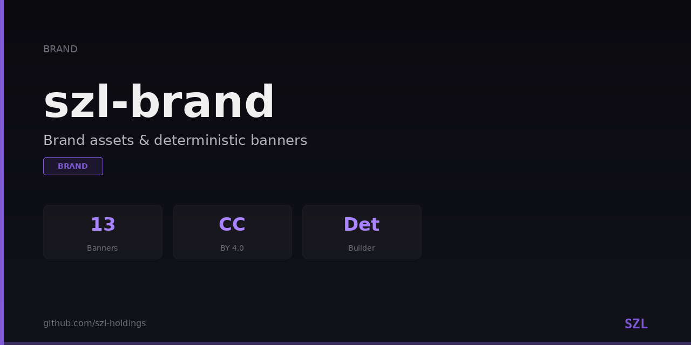

<div align="center">



# KANCHAY design system

The versioned visual and public-claim system for SZL Holdings.

[Documentation](https://holdings.a-11-oy.com/docs-site/brand.html) · [GitHub organization](https://github.com/szl-holdings) · [Hugging Face](https://huggingface.co/SZLHOLDINGS) · [Security](./SECURITY.md)

</div>

## One system, four guarantees

KANCHAY makes an SZL surface recognizable without letting presentation outrun evidence.

| Contract | What it guarantees |
|---|---|
| **Tokens** | A single color, type, spacing, radius, elevation, and motion vocabulary. |
| **Components** | Accessible buttons, cards, status chips, receipts, control docks, navigation, and evidence panels. |
| **Metadata** | Every public page declares its source, evidence URL, canonical URL, and honest status. |
| **Adapters** | Deterministic framework bundles with SHA-256 integrity and an exact source revision. |

The design system is calm, technical, and evidence-forward. Coral is the decision accent; teal
is the interaction and focus color; gold is reserved for doctrine and premium emphasis. Status is
always written in text and never communicated by color alone.

## Quickstart

The SDK requires Python 3.12 or newer.

```bash
git clone https://github.com/szl-holdings/szl-brand.git
cd szl-brand
python -m pip install -e ".[dev]"
python -m pytest tests -q
```

Export a byte-deterministic design-system bundle from an immutable source revision:

```bash
python -m szl_brand export-system \
  --source-revision "$(git rev-parse HEAD)" \
  --output ./dist/kanchay
```

The export contains:

```text
dist/kanchay/
├── manifest.json          # contract, version, exact source, per-file hashes, root hash
├── system.css             # tokens + accessible components + reduced-motion behavior
├── tokens.json            # typed token source and measured contrast pairs
├── metadata.schema.json   # fail-closed public metadata convention
└── vitepress.css          # first framework adapter
```

Identical inputs and the same source SHA produce byte-identical outputs. Checkout exports read the
asset blobs from the canonical repository's exact `HEAD`; wheel exports require build-embedded
revision and per-asset hashes. Mutable refs, mismatched revisions, forks, abbreviated SHAs,
uppercase SHAs, and path-like values are rejected.

## Use the system

For a plain web surface:

```html
<link rel="stylesheet" href="/brand/system.css">
```

```html
<article class="evidence-card">
  <header class="evidence-card__header">
    <h2 class="evidence-card__title">Runtime readiness</h2>
    <span class="chip chip-proven">REAL</span>
  </header>
  <dl class="evidence-card__meta">
    <div><dt>Source</dt><dd><code>cad529a2...</code></dd></div>
    <div><dt>Evidence</dt><dd><a href="/evidence">Open verification</a></dd></div>
  </dl>
</article>
```

For VitePress, keep `vitepress.css`, `system.css`, and the manifest together, then import the
adapter from the theme entry point. The adapter consumes only canonical KANCHAY tokens and has no
runtime font or stylesheet dependency.

## Repository map

| Path | Responsibility |
|---|---|
| [`kit/tokens`](./kit/tokens) | Canonical typed tokens and component stylesheet. |
| [`kit/contracts`](./kit/contracts) | Public metadata and truth-label schemas. |
| [`kit/adapters`](./kit/adapters) | Deterministic framework adapters. |
| [`docs/FRONTEND_HARDENING.md`](./docs/FRONTEND_HARDENING.md) | Estate-wide responsive, accessibility, state, performance, and PR acceptance contract. |
| [`src/szl_brand`](./src/szl_brand) | Export, integrity, validation, preview, and CLI implementation. |
| [`tests`](./tests) | Determinism, tamper, accessibility, metadata, CLI, palette, and asset gates. |
| [`social-previews`](./social-previews) | Deterministically generated GitHub preview assets. |
| [`anatomy`](./anatomy) | Visual anatomy source and rendered figures. |
| [`motion`](./motion) | Governed motion studies and exports. |

## Truth and accessibility contract

- Public status vocabulary is exactly `REAL`, `MEASURED`, `MODELED`, `ROADMAP`, or `UNAVAILABLE`.
- Every metadata record requires source and evidence URLs.
- Focus is visible, status has a text label, and forced-colors mode keeps state indicators legible.
- `prefers-reduced-motion: reduce` collapses nonessential animation and transition duration.
- The exported VitePress adapter has no runtime CDN or font download.
- The current supply-chain posture is SLSA L1; stronger levels are not claimed here.
- Front-end consumers follow the [`KANCHAY hardening standard`](./docs/FRONTEND_HARDENING.md),
  including control-dock ownership, safe areas, truthful runtime states, and Core Web Vitals budgets.

See [`kit/brand-bible.md`](./kit/brand-bible.md) for voice and naming, and
[`kit/tokens/COLOR_CONTRAST_REPORT.md`](./kit/tokens/COLOR_CONTRAST_REPORT.md) for measured contrast
pairs.

## Generate and validate social previews

```bash
python -m szl_brand generate --output social-previews
python -m szl_brand validate social-previews
python -m szl_brand manifest social-previews --output brand-manifest.json
python -m szl_brand drift --manifest brand-manifest.json social-previews
```

The GitHub social preview is a repository setting, so generated images remain reviewable artifacts;
this repository does not silently mutate other repositories.

## Governance

Changes use protected pull requests, executable tests, and normal branch
protection. Brand doctrine is additive to the locked proof register and does not change theorem,
axiom, or `sorry` counts.

- Code and tokens: Apache-2.0 where identified in [`kit/LICENSE`](./kit/LICENSE)
- Brand assets: CC BY 4.0 under the repository [`LICENSE`](./LICENSE)
- Attribution: SZL Holdings, ORCID `0009-0001-0110-4173`

## Citation

```bibtex
@software{szl_holdings_kanchay_2026,
  title   = {KANCHAY: the SZL Holdings design system},
  author  = {{SZL Holdings}},
  year    = {2026},
  version = {1.1.0},
  doi     = {10.5281/zenodo.20434276},
  url     = {https://github.com/szl-holdings/szl-brand}
}
```
