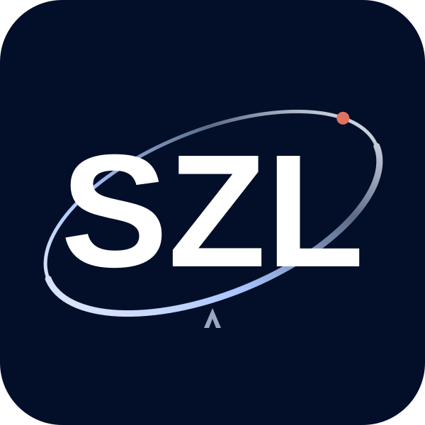

# SZL Orbit v2



Production vector adaptation of the founder-approved matching SZL and space-ring direction.
All three letters use a consistent sans-serif outline, shared scale and baseline. The mark
retains the navy tile, authored -22-degree orbit, single coral claim node and quiet lambda.
The lambda is identity artwork; it does not assert that Conjecture 1 is proved.

## Asset contract

- Master: `kit/logos/orbit-v2/szl-orbit.svg`.
- Integrity: `manifest.json` binds the exact UTF-8 SVG bytes with SHA-256.
- Self-contained paths only: no runtime fonts, embedded images, scripts, animation or external resources.
- Accessible SVG title and description. Consumers should use `alt="SZL Holdings"` on an image;
  when adjacent link text already names SZL Holdings, use decorative `alt=""` instead.
- Preserve the viewBox/aspect ratio. Reserve both width and height to prevent layout shift.
- Use 64-128px for the parent mark in cards and at least 32px for small UI marks. Inspect actual
  raster exports at 16px before using them; tiny lambda/orbit details are not meaningful at that size.
- Export PNG from this vector for email, platform avatars and Apple touch icons. SVG source
  remains authoritative. Never present an upscaled screenshot as a high-resolution vector.

The lettering uses static outlines derived from Liberation Sans Bold. No font software is
included or fetched at runtime. See the project's existing license and trademark reservation;
this change does not grant rights to SZL Holdings trademarks or change platform identities.

## Ordered adoption

1. Admit this source through the existing protected PR and exact-head tests.
2. Copy the exact admitted SVG into `.github/profile/assets/szl/logos/szl_mark_holographic.svg`
   with an adjacent record naming the admitted source commit and SHA-256. This is the existing
   shared logo URL consumed by repository cards, HF card templates and many Space READMEs.
3. Let the existing `.github` organization-card publisher project it into
   `SZLHOLDINGS/README/assets/szl-mark-holographic.svg`; do not edit the generated Hub card.
4. Upgrade the `a11oy` and `a11oy-net` parent-logo/favicon placements through their source PRs.
   Preserve local asset inventories, integrity manifests, CSP, product names, citations and
   the legacy KANCHAY bundle until its versioned migration is reviewed together.
5. Verify asset bytes and rendering on GitHub, Hugging Face, `a-11-oy.com`, then `a11oy.net`.
   Pushed, merged, published, cached and live-verified are separate states.

Account avatars and repository social-preview settings are not README files. Record their
settings update separately; a logo commit does not establish that those settings changed.
Do not overwrite vertical marks, historical evidence images, licensed partner logos or
unrelated app icons. No product or evaluation result is upgraded by a branding change.

## Derived placements

[`suite/`](suite/) holds every derived placement: single-color and holographic variants, 16 to
48 px icons, the favicon set, a round-crop-safe avatar, app and maskable icons, and a 1200×630
social image. All are generated from this master by `szl-brand orbit-suite` and pinned in
`suite/manifest.json`. [`suite/README.md`](suite/README.md) says which file goes where.

## Verification

```bash
python -m pytest tests/test_orbit_v2.py -q
```

Run the repository's complete required checks before merge. The targeted offline tests verify
source hashing, static vector safety, accessible naming, letter-group consistency, and the
single node's position on the rotated orbit. They are not browser or live-deployment evidence.

`manifest.json` deliberately records `NOT_ATTESTED`: deployment receipts belong to each
consumer's exact deployed revision, not to an optimistic declaration inside the artwork.
