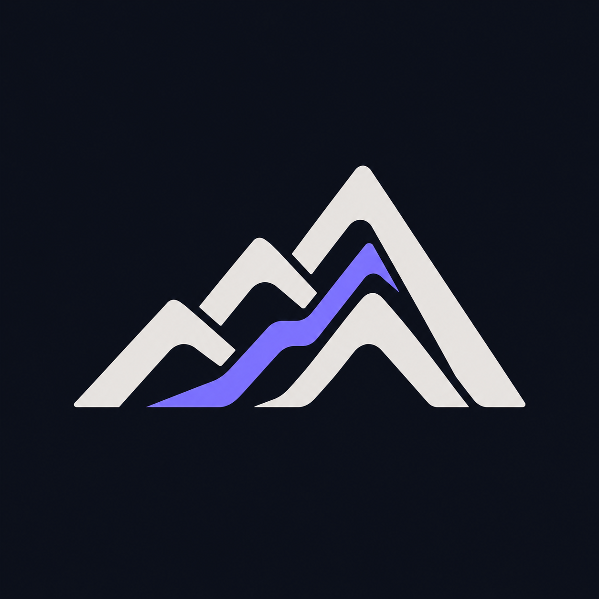

# SZL mountain symbol v1

Stephen Lutar selected this mountain/technology direction for SZL on 2026-10-05. The PNG is the approved visual reference, not evidence of deployment or an operational product.

## Source

Original AI-generated raster artwork: layered ivory alpine ridges and a violet ascending path on a dark background. No third-party logo or asset was copied into this directory. This is not a trademark-clearance or exclusivity claim. Existing repository asset terms apply; this change does not amend licensing.

The source PNG is 1254 x 1254 RGB, 938960 bytes. Exact SHA-256 and Git blob identity are in manifest.json. It has an opaque background and is not a vector master.

## Rollout boundary

This additive source packet preserves the current orbit/monogram assets, KANCHAY bundle, SDK export lists, profile projections, favicon rollout and all runtime configuration. Existing consumers do not automatically switch to this image.

Before adoption, prepare a reviewed vector/small-size rendition and usage extension, verify circle crops and 16/24/32/48px readability, light/dark usage, accessible alternative text, and each canonical publisher's source/readback contract. Do not silently replace shared logo URLs or publish directly to Hugging Face.

GitHub source -> admitted Hugging Face projections -> a-11-oy.com product -> a11oy.net proof. These are separate verification stages.

The repository's existing successful-main Tests workflow may trigger publication of two marketing Spaces, even for passive source assets. A draft PR is not deployment approval; qualification of that existing trigger is required before admission.
